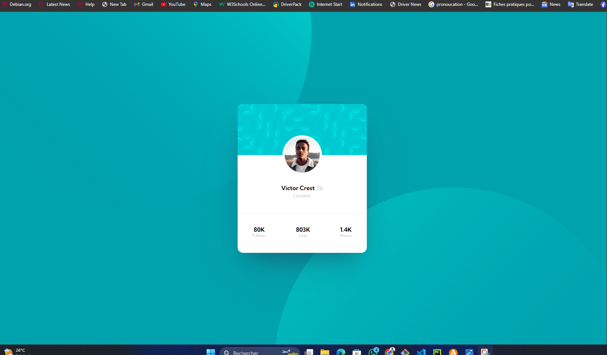

# Frontend Mentor - Profile card component solution

This is a solution to the [Profile card component challenge on Frontend Mentor](https://www.frontendmentor.io/challenges/profile-card-component-cfArpWshJ). Frontend Mentor challenges help you improve your coding skills by building realistic projects. 

## Table of contents

- [Frontend Mentor - Profile card component solution](#frontend-mentor---profile-card-component-solution)
  - [Table of contents](#table-of-contents)
  - [Overview](#overview)
    - [The challenge](#the-challenge)
    - [Screenshot](#screenshot)
    - [Links](#links)
  - [My process](#my-process)
    - [Built with](#built-with)
    - [What I learned](#what-i-learned)
    - [Continued development](#continued-development)
    - [Useful resources](#useful-resources)
  - [Author](#author)


**Note: Delete this note and update the table of contents based on what sections you keep.**

## Overview

### The challenge

- Build out the project to the designs provided

### Screenshot



### Links

- Solution URL: [Add solution URL here](https://your-solution-url.com)
- Live Site URL: [Add live site URL here](https://your-live-site-url.com)

## My process

### Built with

- Semantic HTML5 markup
- SCSS custom properties
- Flexbox
- CSS Grid
- Mobile-first workflow
- SASS


### What I learned

Using scss and BEM Methodolody

```html
<div class="card__head">
            
        </div>
```
```css
    .container {
        position: relative;
        width: 100%;
        height: 100%;
        display: flex;
        justify-content: center;
        align-items: center;
        
        overflow: hidden;
        &__top-image {
          position: absolute;
          left: -7%;
          top: -48%;
          margin: 0;
          padding: 0;
        }}
```

### Continued development

i want to master responsive and using position in css
-i want to master mobile first

### Useful resources

- https://en.bem.info/methodology/css/

## Author

- Website - [marion](https://personnal-portfolio-react.vercel.app/)
- Frontend Mentor - [marion586](https://www.frontendmentor.io/profile/marion586)
- Linkedin - [@marionmenye](https://www.linkedin.com/in/rakotomandimby-marion-menye-08a186287/)

